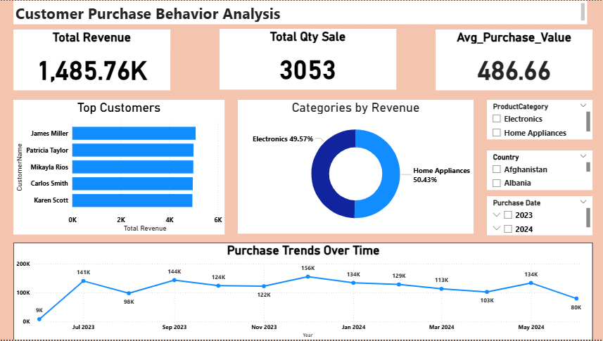

# Customer Purchase Behavior Analysis and Reporting

## 📌 Objective
Build an end-to-end **Customer Purchase Behavior Analysis and Reporting System** using **MySQL, Python, and Power BI** to analyze customer purchase patterns, identify key performance indicators, and create insightful visual reports for business decision-making.

---

## 🛠 Tools & Technologies
- **MySQL** (Data storage, transformation, and aggregation)
- **Python** (Data extraction, analysis, and generating summary insights)
- **Power BI** (Data visualization & interactive reporting)
- **Excel / CSV** (Initial dataset source)

---

## 📂 Dataset Description
The dataset contains detailed customer purchase records for an online retail company.

**Columns:**
- `TransactionID` → Unique ID for each transaction  
- `CustomerID` → Unique ID for each customer  
- `CustomerName` → Name of the customer  
- `ProductID` → Unique ID for each product  
- `ProductName` → Name of the product  
- `ProductCategory` → Product classification (e.g., Electronics, Home Appliances)  
- `PurchaseQuantity` → Number of items purchased  
- `PurchasePrice` → Price per unit  
- `PurchaseDate` → Date of purchase  
- `Country` → Customer's country  

> **Note:** The provided dataset was already clean, so no additional data cleaning steps were required.

---

## 🔄 Project Workflow

### **1️⃣ Data Storage & Transformation (MySQL)**
- Created a database in MySQL to store the purchase data.
- Imported the CSV dataset into MySQL using `Table Data Import WizardE` to load the provided CSV file.
- Created separate tables for Customers, Products, and Transactions for better organization (Normalization).
- Wrote aggregation queries to:
  - Calculate total purchases per customer
  - Total sales per product/category
  - Monthly & yearly revenue trends

---

### **2️⃣ Data Analysis (Python)**

#### 📁 Files Created
- **`data.py`** → Python script for **VS Code / terminal users** to run analysis directly.
- **`Jupyter users.ipynb`** → Jupyter Notebook version for step-by-step interactive execution.

#### 📌 Analysis Performed
- **Total Revenue**
- **Total Quantity Sold**
- **Average Purchase Value**
- **Top Customers by Revenue**
- **Top Product Categories**
- **Monthly Sales Trends**
- Generated a text-based summary of insights.

Both versions connect to the **MySQL database** using `pymysql + SQLAlchemy` and perform the same set of operations.

---

### **3️⃣ Data Visualization & Reporting (Power BI)**
Created an **interactive dashboard** with:
- **KPIs Cards**:
  - Total Revenue
  - Total Quantity Sold
  - Average Purchase Value
- **Bar Chart** → Top Customers by Revenue
- **Donut Chart** → Categories by Revenue
- **Line Chart** → Purchase Trends Over Time
- **Slicers** → Filter by Product Category, Country, Purchase Date
- **Dynamic Interactions** → All visuals update based on slicer selection

---

## 📊 Final Dashboard Preview

---

## 💡 Key Insights
- Identified top 5 customers contributing the highest revenue.
- Seasonal peaks in purchase activity during certain months.
- Certain product categories dominate total revenue.
- Some countries have significantly higher average order values.
  
---

## ✅ Conclusion
This project demonstrates how **MySQL, Python, and Power BI** can be integrated to:
- Efficiently store and process structured datasets
- Perform meaningful data analysis
- Build visually appealing and interactive dashboards for business insights

The same approach can be extended to other retail datasets to optimize marketing strategies, inventory management, and customer relationship management.

---
